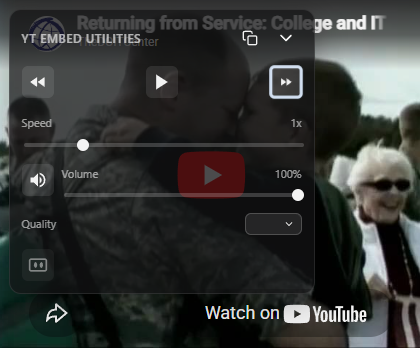

# YouTube Embedded Utilities

[](https://developer.chrome.com/docs/extensions/mv3/intro/)
[](https://www.typescriptlang.org/)
[](https://opensource.org/licenses/MIT)
[](https://vitejs.dev/)
[](https://github.com/Azizham66/youtube-utils/releases)

A professional, production-ready Chrome Extension that injects a sleek, glassmorphic control overlay onto any website containing embedded YouTube videos. Control playback, quality, volume, and more without interacting with the native YouTube UI.



*Floating control menu with quality and CC sync*


*Minimized draggable gear icon for quick access*

## Features

- **Glassmorphic UI**: High-end, transparent design with blur effects and smooth animations.
- **Complete Playback Control**: Play/Pause, Relative Seek (±5s), and Playback Speed adjustment.
- **Advanced Syncing**:
    - **Quality Selection**: Real-time quality switching (1080p, 720p, etc.) using internal player hooks.
    - **CC Toggle**: Synchronized Closed Captions toggle.
    - **State Mirroring**: UI buttons stay in sync even if you use the native YouTube player controls.
- **2D Draggable Interface**: Move the control window anywhere within the video player bounds.
- **Quick Copy**: One-click button to copy the YouTube video URL to your clipboard.
- **Keyboard Shortcuts**: 
    - `Shift + Up/Down`: Increase/Decrease playback speed.
- **Domain Memory**: Remembers your preferred playback speed for each website you visit.

## Installation (Manual/Developer Mode)

Since this extension is not currently on the Web Store, you can install it manually:

1.  **Download** or Clone this repository.
2.  Ensure you have the `dist` folder ready (if you are a developer, run `npm run build`).
3.  Open Google Chrome and navigate to `chrome://extensions/`.
4.  Turn on **Developer mode** (toggle in the top right).
5.  Click **Load unpacked**.
6.  Select the `dist` folder from this project directory.

## Development

This project is built with Vite, TypeScript, and the @crxjs/vite-plugin.

### Prerequisites
- Node.js (v16+)
- npm

### Setup
```bash
# Install dependencies
npm install

# Run development server with HMR
npm run dev

# Build for production
npm run build
```

## License
This project is open-source and available under the MIT License.
